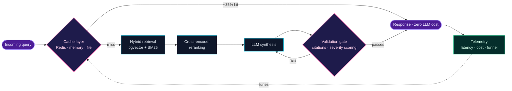

<div align="center">


<a href="https://linkedin.com/in/pragyan-dhar">
  
</a>

<br/>

<a href="https://linkedin.com/in/pragyan-dhar"></a>
<a href="https://github.com/pragyandhar"></a>
<a href="mailto:pragyandhar@gmail.com"></a>


</div>

---

```yaml
# ~/pragyandhar/manifest.yaml
identity:
  name:      Pragyan Chandra Dhar
  role:      B.Tech CSE — AI/ML Specialization @ GLA University, Mathura
  graduates: 2027
  based_in:  Delhi, India

what_i_do:
  - Design retrieval systems that answer correctly and cheaply, at the same time
  - Orchestrate LLM agents with checkpointing, retries and human-in-the-loop gates
  - Instrument everything — if it isn't measured, it isn't shipped

operating_principles:
  - Latency and cost are product features, not afterthoughts
  - A cache hit is the cheapest inference you will ever run
  - Every LLM output is untrusted input until something validates it

currently:
  building:  reliability + evaluation tooling for LLM-generated code
  learning:  distributed systems, retrieval evaluation, low-level design
  open_to:   AI/ML engineering and backend internships & full-time roles
```

---

## Live in production

Not a side project. Real users, real invoices, real on-call.

### **AskGLA** — AI Admissions Assistant · *deployed on GLA University's official website*

| Signal | Value |
| :--- | :--- |
| Queries served | **~8,000** across 4,000+ sessions in 30 days |
| Monthly active users | **3,100+** |
| Average latency | **~3s** end-to-end |
| Cache hit rate | **~35%** resolved with zero LLM calls |
| Inference cost | **~$20/month** — about **₹0.21 per conversation** |
| Conversion impact | **270+** high-intent leads · **300+** admission-conversion clicks |
| Surfaces | Web widget · Chrome extension · Admin console |
| Languages | English · Hindi · Hinglish |

**Stack:** FastAPI · React · Azure · Supabase/Postgres (pgvector) · Redis · Docker · GitHub Actions
**Retrieval:** hybrid — pgvector dense + BM25 sparse + cross-encoder reranking
**Guided by:** Prof. Dr. Ram Manohar Nisarg · Prof. Gaurav Bathla · Prof. Dr. Ashok Bhansali

---

## How I think about a request

The same shape shows up in everything I build — spend nothing until you have to, and never trust the model's output blindly.



---

## Things I've built

<table>
<tr>
<td width="50%" valign="top">

### 🧭 Khoj
**Multi-Agent Research Orchestration**

LangGraph orchestration across **5 specialised agents**, with PostgreSQL checkpointing and time-travel debugging.

- Exponential-backoff retry logic → **−70% agent failure rate**
- Redis caching with MD5 fingerprinting → **−40% redundant LLM spend**
- SSE token streaming, human-in-the-loop interrupt gates, citation-verification subgraph
- Repository Pattern architecture — non-LLM endpoints hold **sub-50ms** under concurrent load

`Python` `FastAPI` `LangGraph` `LangChain` `PostgreSQL` `Redis` `ChromaDB` `React` `Docker` `Tavily`

</td>
<td width="50%" valign="top">

### 🛡️ Shinrai
**AI Code Reliability Layer**

An async validation pipeline that treats LLM-generated code as guilty until proven safe.

- **12 reliability and security checks** → ~70% lower faulty-deployment risk
- Tiered severity scoring (Critical/Major/Minor) with weakest-link aggregation — 3-dimension confidence in **<200ms**
- Auto-repair loop re-prompts the model with structured issue context → **~80%** of low-confidence code fixed within 3 retries

`FastAPI` `Celery` `Redis` `SQLite` `Azure AI Foundry` `Bandit` `Ruff` `Mypy` `pip-audit` `Docker`

</td>
</tr>
</table>

---

## Stack

<div align="center">

**Languages**


**AI / Orchestration**


**Backend**


**Data & Vectors**


**Infrastructure**


</div>

<details>
<summary><b>System design patterns I actually use →</b></summary>

<br/>

| Pattern | Where it earned its keep |
| :--- | :--- |
| Hybrid retrieval (dense + sparse + rerank) | AskGLA — recall from BM25, precision from the reranker |
| Multi-layer caching (Redis → memory → file) | Cut ~35% of traffic before it ever reaches a model |
| Async pipelines with Celery workers | Shinrai — 12 parallel checks without blocking the API |
| Fault-tolerant checkpointing | Khoj — resume a 5-agent graph from any prior state |
| Repository Pattern | Keeps non-LLM endpoints under 50ms regardless of agent load |
| Human-in-the-loop interrupt gates | Never let an agent commit an irreversible step unreviewed |
| Multi-tenant architecture | One deployment, isolated data boundaries |

</details>

---

## GitHub

<div align="center">


<br/><br/>


</div>

---

## Beyond the terminal

- 🎤 Delivered a **7-hour Power BI workshop** at TechNavya'24, GLA University's official tech fest
- 📚 Taught for a year in **Ajhai village** with the Udaan Asma Tak NGO — the best debugging practice I've had is explaining something to someone who has no reason to pretend they understood
- 🎓 CGPA **8.23/10** · Class 12 **85%** · Class 10 **95%**

---

## Talk to me about

<div align="center">

`retrieval evaluation` · `cutting inference cost without cutting quality` · `agent failure modes` · `caching strategy` · `Postgres over a vector DB, and when it stops being true` · `shipping student projects to real users`

</div>

<br/>

<div align="center">

**Open to AI/ML engineering and backend roles.**
If you're hiring for systems that have to stay up — let's talk.

<a href="https://linkedin.com/in/pragyan-dhar"></a>
<a href="mailto:pragyandhar@gmail.com"></a>


</div>
